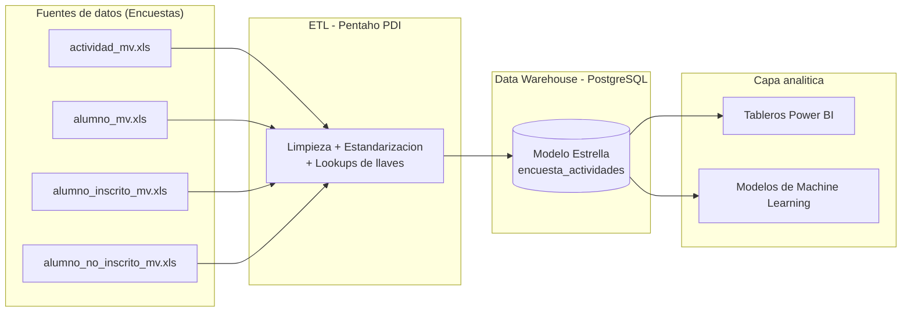

# Actividades Extracurriculares — Solución de Business Intelligence

Solución integral de Business Intelligence para el análisis de actividades extracurriculares universitarias. El proyecto cubre el ciclo completo del dato: desde la extracción y limpieza de las encuestas (ETL), pasando por su modelado en un Data Warehouse, hasta su visualización ejecutiva en Power BI y la aplicación de modelos de Machine Learning para generar insights accionables.

## Tabla de contenidos

- [Objetivo](#objetivo)
- [Arquitectura del flujo](#arquitectura-del-flujo)
- [Stack tecnológico](#stack-tecnológico)
- [Estructura del repositorio](#estructura-del-repositorio)
- [Modelo de datos (Data Warehouse)](#modelo-de-datos-data-warehouse)
- [Componentes del proyecto](#componentes-del-proyecto)
- [Requisitos previos](#requisitos-previos)
- [Cómo ejecutar el flujo completo](#cómo-ejecutar-el-flujo-completo)
- [Documentación](#documentación)

## Objetivo

Determinar el nivel de participación, las preferencias y el perfil de los estudiantes (matrícula, carrera, cuatrimestre, turno, género y edad) en relación con las actividades extracurriculares, con el fin de ajustar los programas para que respondan a sus intereses, necesidades y disponibilidad de tiempo.

Los resultados sirven como base para la planeación estratégica, la mejora continua y la toma de decisiones en la gestión universitaria, permitiendo diseñar programas más inclusivos y adaptados a las necesidades reales de la comunidad estudiantil.

## Arquitectura del flujo



El proceso es lineal: las encuestas en Excel se procesan con Pentaho, se cargan a un Data Warehouse en PostgreSQL bajo un modelo estrella, y desde ahí se consumen tanto en los tableros de Power BI como en los modelos de Machine Learning.

## Stack tecnológico

| Capa | Herramienta |
|------|-------------|
| ETL | Pentaho Data Integration (Spoon / PDI) |
| Data Warehouse | PostgreSQL `5432` — BD `encuesta_actividades` |
| Visualización | Power BI Desktop |
| Machine Learning | K-Means, NLP, Autoencoder Neural + PCA |
| Fuentes | Archivos Excel (`.xls`) de encuestas |

## Estructura del repositorio

```
actividades_e_powerbi/
├── etl/
│   └── ACTIVIDADES EXTRACURRICULARES_PENTAHO.ktr   # Transformación Pentaho (ETL)
├── reportes_powerbi/
│   └── ACTIVIDADES_EXTRACURRICULARES_POWERBI.pbix  # Reporte y dashboards Power BI
├── docs/
│   └── DOCUMENTACION DE ACTIVIDADES EXTRACURRICULARES.pdf  # Documentación técnica
├── Explicacion.txt                                 # Resumen del flujo del proyecto
└── README.md
```

## Modelo de datos (Data Warehouse)

El Data Warehouse implementa un modelo estrella centrado en el seguimiento de las inscripciones de estudiantes a actividades.

### Tabla de hechos — `hechoactividadalumno`

Registra cada evento de inscripción (o no inscripción) de un alumno en una actividad.

| Campo | Tipo | Descripción |
|-------|------|-------------|
| `id_hecho` | PK | Identificador único del registro |
| `id_alumno` | FK | Referencia al estudiante |
| `id_actividad` | FK | Referencia a la actividad |
| `inscrito` | bool | Estado de inscripción (completada o no) |
| `saber_actividad` | string | Nivel de conocimiento previo de la actividad |
| `conocimiento_actividad` | string | Grado de información que posee el alumno |
| `problema_inscripcion` | string | Inconvenientes durante el proceso |
| `facilacceso` | string | Facilidad de acceso al sistema de inscripción |
| `sugerencia_actividad` | string | Sugerencias de mejora del alumno |

### Dimensión — `alumno`

Información demográfica y académica del estudiante.

| Campo | Descripción |
|-------|-------------|
| `id_alumno` (PK) | Identificador único |
| `matricula` | Matrícula institucional |
| `nombre` | Nombre completo |
| `carrera` | Programa académico |
| `cuatrimestre` | Cuatrimestre cursado |
| `turno` | Matutino / vespertino / nocturno |
| `genero` | Género (análisis demográfico) |
| `edad` | Edad del estudiante |

### Dimensión — `actividad`

Catálogo de actividades extracurriculares disponibles (`id_actividad`, `nombreActividad`).

### Tablas puente

- `alumnoinscritoactividad` — relaciona alumnos inscritos con sus actividades y captura el feedback de cada inscripción.
- `alumnonoinscritoactividad` — captura información de alumnos que conocen las actividades pero no se inscriben, para el análisis de barreras (carga de trabajo, conflictos de horario, interés futuro, etc.).

Relaciones principales: `actividad → hechoactividadalumno` (1:N) y `alumno → hechoactividadalumno` (1:N).

## Componentes del proyecto

### 1. Proceso ETL (Pentaho)

> Archivo: `etl/ACTIVIDADES EXTRACURRICULARES_PENTAHO.ktr`

Es el motor del proyecto. La transformación de Pentaho Data Integration:

1. Extrae los datos de 4 archivos Excel de encuestas (`ExcelInput`).
2. Limpia nulos y estandariza formatos (fechas, texto).
3. Resuelve llaves contra el DW mediante búsquedas (`DBLookup` sobre `Actividad` y `Alumno`).
4. Carga los resultados a las tablas de PostgreSQL (`TableOutput`).

| Entrada (Excel) | Salida (Tabla PostgreSQL) |
|-----------------|----------------------------|
| `actividad_mv.xls` | `Actividad` |
| `alumno_mv.xls` | `Alumno` |
| `alumno_inscrito_mv.xls` | `AlumnoInscritoActividad` |
| `alumno_no_inscrito_mv.xls` | `alumnonoinscritoactividad` |

### 2. Reporte Interactivo (Power BI)

> Archivo: `reportes_powerbi/ACTIVIDADES_EXTRACURRICULARES_POWERBI.pbix`

Es la capa de visualización. Importa los datos ya procesados y contiene el modelo de datos, las medidas DAX (conteo de alumnos, horas totales, etc.) y los tableros ejecutivos interactivos para la toma de decisiones.

### 3. Machine Learning

Para potenciar el análisis se implementaron tres modelos:

| # | Modelo | Técnica | Propósito |
|---|--------|---------|-----------|
| 1 | Motivos de no inscripción | K-Means + NLP (no supervisado) | Agrupa cientos de comentarios de texto libre en 3 categorías de acción: apoyo social, conflictos de horario/laborales y barreras de información. |
| 2 | Recomendador de actividades | Clasificación (supervisado) | Captura los intereses del alumno (creativo, físico, estrategia…) como un vector de perfil y predice la actividad que mejor se adapta a su personalidad. |
| 3 | Análisis de sugerencias | Autoencoder Neural + PCA + K-Means (deep learning no supervisado) | Comprime sugerencias de texto (100 → 32 dimensiones) y las agrupa en clusters temáticos (ej. mejoras de infraestructura). |

Valor de negocio: la administración deja de leer cientos de comentarios uno por uno y pasa a atacar frentes de acción concretos identificados automáticamente.

## Requisitos previos

- Pentaho Data Integration (Spoon) — para ejecutar el ETL.
- PostgreSQL — instancia local en el puerto `5432` con la base `encuesta_actividades`.
- Power BI Desktop — para abrir y refrescar el reporte.
- Los archivos fuente (`*_mv.xls`) en una ruta local accesible.

## Cómo ejecutar el flujo completo

1. Preparar la base de datos. Crea la base `encuesta_actividades` en PostgreSQL y verifica que escuche en el puerto `5432`.
2. Configurar el ETL. Abre el archivo `.ktr` en Pentaho (Spoon). Ajusta la conexión de base de datos y las rutas de los archivos Excel de entrada según tu equipo.
3. Ejecutar el ETL. Lanza la transformación para poblar las tablas del Data Warehouse con los datos limpios.
4. Actualizar Power BI. Abre el `.pbix`, ve a Transformar datos y actualiza la ruta / conexión del origen para que apunte al DW generado en el paso anterior.
5. Visualizar. Refresca el reporte y explora los indicadores en los tableros.

## Documentación

La documentación técnica completa (objetivo, modelo estrella, transformaciones, tableros y detalle de los modelos de ML) se encuentra en:

> `docs/DOCUMENTACION DE ACTIVIDADES EXTRACURRICULARES.pdf`
